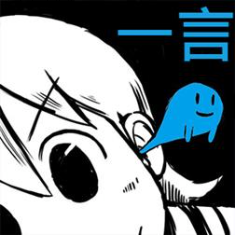

   
  
   
   

## 关于一言

> 一款 Windows Phone 8.1 应用

简单来说，一言（ヒトコト）指的是就是一句话，可以是动漫中的台词，可以是小说中的语句，也可以是网络上的各种小段子。

或是感动，或是开心，又或是单纯的回忆，来到这里，留下你所喜欢的那一句句话，与大家分享，这就是一言存在的目的。

- ✔支持动态磁贴显示一言。(只支持宽磁贴)
- ✔支持锁屏上显示一言。(需将一言在锁屏设置中设置为详细状态)
- ✔通过投稿，您可以和所有人分享您所喜欢的一言。(需审核)
- ✔在主页面随机查看新的一言。
- ✔创建属于你自己的一言收藏。(无需审核)
- ✔支持手势动作,仅主页面(左:前往我的一言,右:随机一言,下:收藏一言)

## 结语

早年学生时期开发的一款 Windows Phone 8.1 应用。当时自学 C# 跟着教程边学边写，所以写得很烂，但最后终于开发完成，并且成功上线，还更新了几个版本。

随着 Windows Phone 衰弱......

1% ......

0.1% ......

0%

> 我们所度过的每个平凡的日常,也许就是连续发生的奇迹。 —— [《日常》](http://www.shinonome-lab.com/)
